# ML-DL-Ops Assignment-1

**Performance, Accuracy and Compute Analysis on MNIST & FashionMNIST**

[](https://www.python.org/downloads/)
[](https://pytorch.org/)
[](LICENSE)

---

## 👤 Author Information

- **Name:** Shikhar Dave
- **Course:** ML-DL-Ops
- **Assignment:** 1

---

## 📋 Table of Contents

- [Project Overview](#-project-overview)
- [Repository Structure](#-repository-structure)
- [Datasets](#-datasets)
- [Methodology](#-methodology)
  - [Q1(b): Support Vector Machines](#q1b-support-vector-machines)
  - [Q1(a): Deep Learning Models](#q1a-deep-learning-models)
  - [Q2: Compute Analysis](#q2-compute-analysis)
- [Results & Visualizations](#-results--visualizations)
- [Key Findings](#-key-findings)
- [Installation](#-installation)
- [Usage](#-usage)
- [Reproducibility](#-reproducibility)
- [Conclusions](#-conclusions)
- [Contact](#-contact)

---

## 📌 Project Overview

This repository presents a comprehensive experimental study comparing **classical machine learning** and **deep learning** approaches on two benchmark datasets: **MNIST** and **FashionMNIST**. 

### Research Focus

The study investigates three critical aspects:

1. **Model Performance**: Accuracy, precision, recall, and F1-scores across different architectures
2. **Training Dynamics**: Learning curves, convergence behavior, and optimization strategies
3. **Computational Efficiency**: CPU vs GPU performance, FLOPs analysis, and parameter counts

### Assignment Components

| Component | Description | Models |
|-----------|-------------|--------|
| **Q1(b)** | Classical ML experiments | SVM with multiple kernels |
| **Q1(a)** | Deep learning experiments | ResNet-18, ResNet-50 |
| **Q2** | Compute & efficiency analysis | CPU vs GPU comparison |

---

## 🎯 Datasets

### MNIST
- **Description**: Handwritten digit recognition (0-9)
- **Size**: 70,000 grayscale images (28×28 pixels)
- **Classes**: 10 digit classes

### FashionMNIST
- **Description**: Fashion product classification
- **Size**: 70,000 grayscale images (28×28 pixels)
- **Classes**: 10 fashion categories (T-shirt, Trouser, Pullover, etc.)

### Data Split Strategy

| Split | Percentage | Purpose |
|-------|-----------|---------|
| **Training** | 70% | Model training |
| **Validation** | 10% | Hyperparameter tuning |
| **Test** | 20% | Final evaluation |

---

## 🧪 Methodology

### Q1(b): Support Vector Machines

#### Model Configuration

- **Implementation**: `sklearn.svm.SVC`
- **Kernels Explored**:
  - Radial Basis Function (RBF)
  - Polynomial

#### Preprocessing Pipeline
```
Raw Images → Flatten → Standard Scaling → PCA (50 components) → SVM
```

#### Hyperparameter Grid

- **RBF Kernel**:
  - C: [0.1, 1, 10, 100]
  - γ: [0.001, 0.01, 0.1, 1]
  
- **Polynomial Kernel**:
  - Degree: [2, 3, 4, 5]
  - C: [0.1, 1, 10]

#### Evaluation Metrics

- ✓ Accuracy
- ✓ Precision (weighted)
- ✓ Recall (weighted)
- ✓ F1-Score (weighted)
- ✓ Confusion Matrix
- ✓ Training Time

---

### Q1(a): Deep Learning Models

#### Architectures

| Model | Layers | Parameters | FLOPs |
|-------|--------|-----------|-------|
| **ResNet-18** | 18 | ~11.2M | ~1.8G |
| **ResNet-50** | 50 | ~23.5M | ~4.1G |

#### Training Configuration
```python
Model Setup:
  - pretrained = False
  - Final FC layer: modified for 10-class output
  
Optimizers:
  - SGD (momentum=0.9, lr=0.01)
  - Adam (lr=0.001)
  
Loss Function: CrossEntropyLoss
Scheduler: ReduceLROnPlateau (patience=3, factor=0.1)
Mixed Precision: Enabled (AMP)
```

#### Training Strategy

- **Epochs**: 1 (for Q2 analysis), extendable
- **Batch Size**: 64
- **Device**: CPU & CUDA GPU
- **Data Augmentation**: Random horizontal flip, normalization

#### Tracked Metrics

- Training Loss & Accuracy (per epoch)
- Validation Loss & Accuracy (per epoch)
- Test Accuracy (final)
- Epoch-wise learning curves

---

### Q2: Compute Analysis

#### Comparison Framework

| Metric | Description | Tool |
|--------|-------------|------|
| **Training Time** | Wall-clock time (ms) | Python `time` |
| **MACs** | Multiply-Accumulate Operations | `ptflops` |
| **FLOPs** | Floating Point Operations | Derived (2 × MACs) |
| **Parameters** | Total model weights | PyTorch |

#### FLOPs Estimation Methodology
```
Forward Pass FLOPs = 2 × MACs
Training FLOPs ≈ 3 × Forward FLOPs (heuristic for forward + backward + update)
```

#### Devices Tested

- **CPU**: Multi-core processor
- **GPU**: CUDA-enabled NVIDIA GPU

---

## 📊 Results & Visualizations

### 🔹 Deep Learning: Training Dynamics

#### MNIST Training Curves

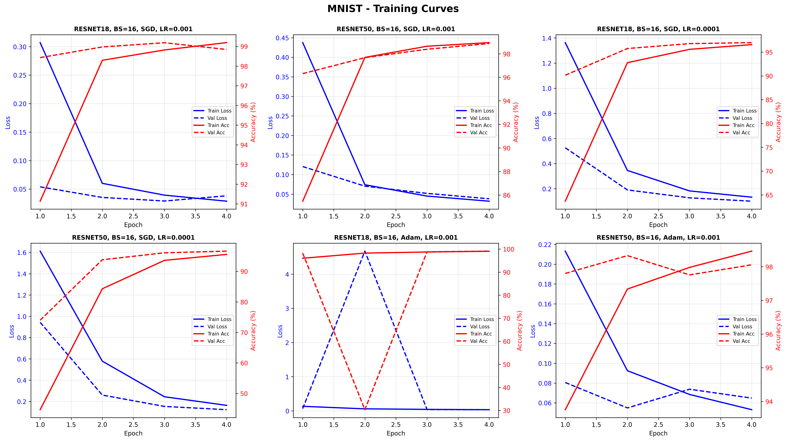

*Figure 1: Training and validation accuracy/loss curves for ResNet-18 and ResNet-50 on MNIST*

#### FashionMNIST Training Curves

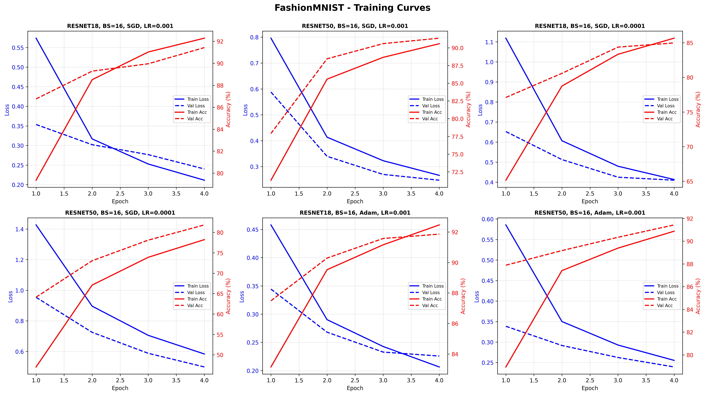

*Figure 2: Training and validation accuracy/loss curves for ResNet-18 and ResNet-50 on FashionMNIST*

---

### 🔹 Deep Learning: Accuracy Analysis

#### MNIST Performance Heatmap

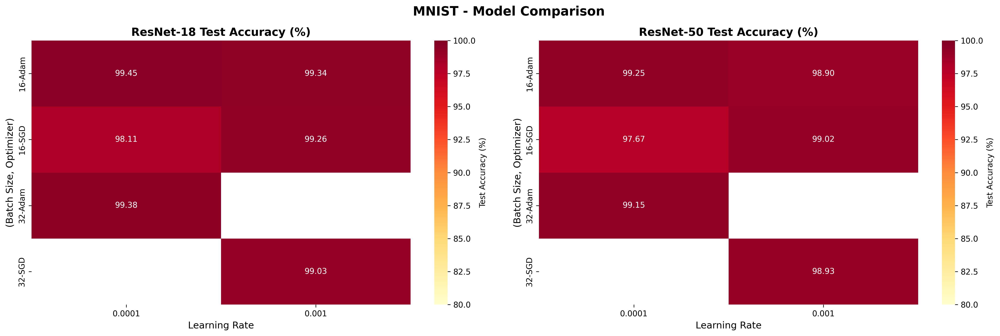

*Figure 3: Test accuracy heatmap across model-optimizer combinations on MNIST*

#### FashionMNIST Performance Heatmap

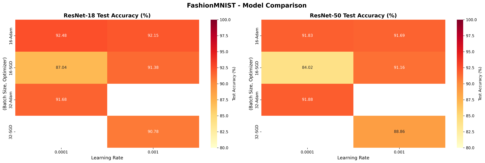

*Figure 4: Test accuracy heatmap across model-optimizer combinations on FashionMNIST*

---

### 🔹 Deep Learning: Model Comparison

#### MNIST Model Comparison

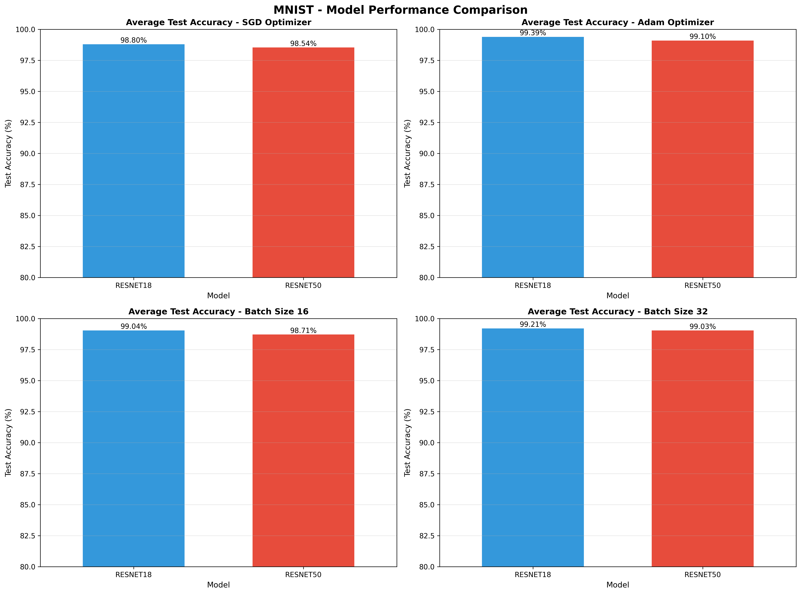

*Figure 5: Comparative performance metrics for ResNet models on MNIST*

#### FashionMNIST Model Comparison

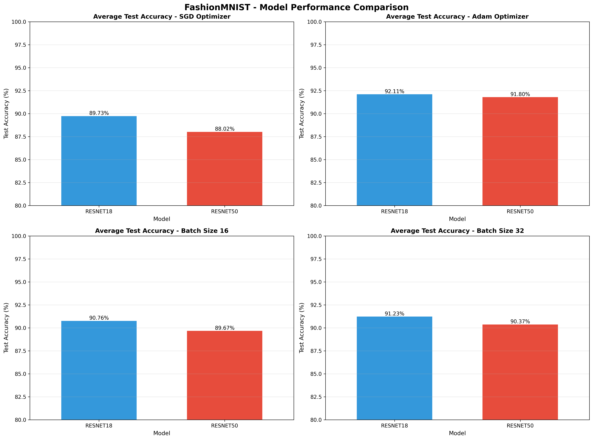

*Figure 6: Comparative performance metrics for ResNet models on FashionMNIST*

---

### 🔹 SVM: MNIST Results

#### Performance Overview

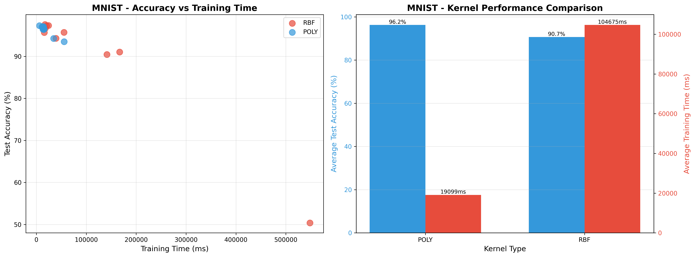

*Figure 7: SVM kernel comparison on MNIST dataset*

#### Confusion Matrix

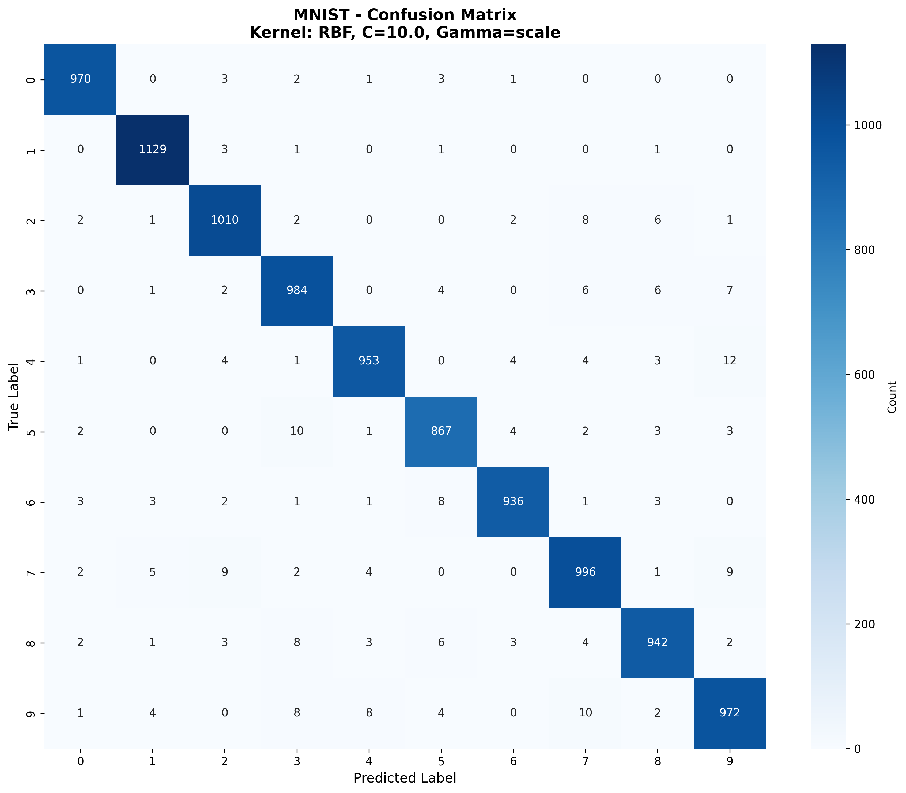

*Figure 8: Best-performing SVM confusion matrix on MNIST*

#### Hyperparameter Analysis

<table>
<tr>
<td width="50%">

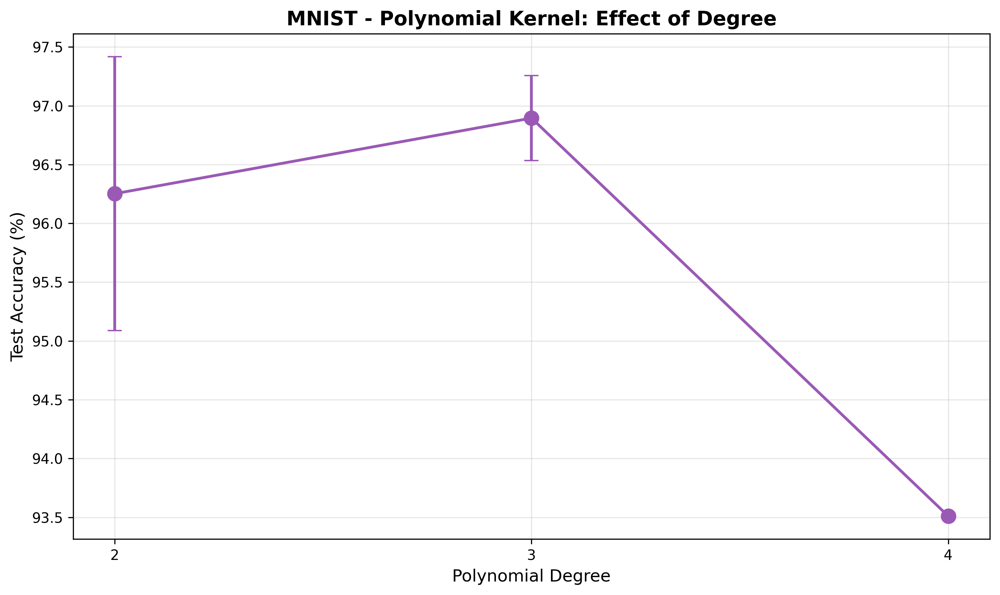

*Figure 9: Polynomial kernel degree analysis*

</td>
<td width="50%">

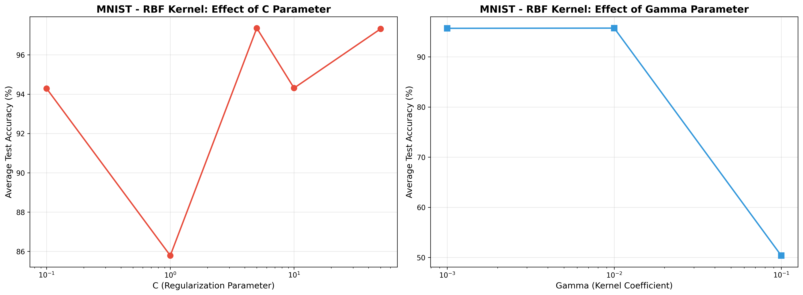

*Figure 10: RBF kernel parameter grid search*

</td>
</tr>
</table>

---

### 🔹 SVM: FashionMNIST Results

#### Performance Overview

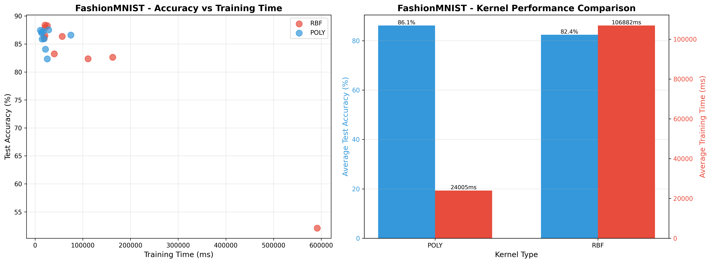

*Figure 11: SVM kernel comparison on FashionMNIST dataset*

#### Confusion Matrix

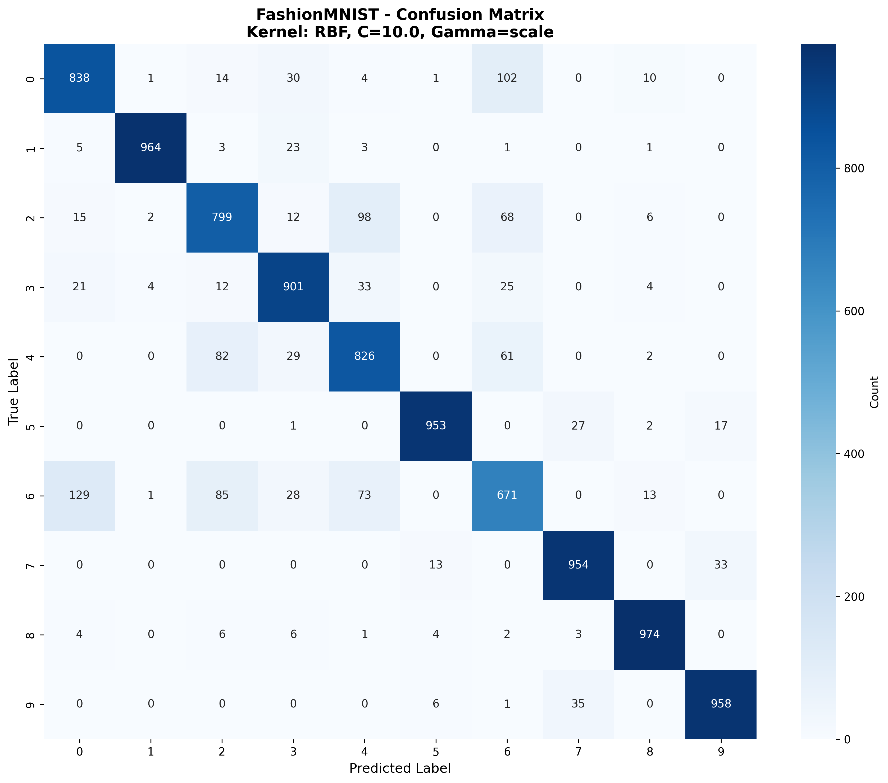

*Figure 12: Best-performing SVM confusion matrix on FashionMNIST*

#### Hyperparameter Analysis

<table>
<tr>
<td width="50%">

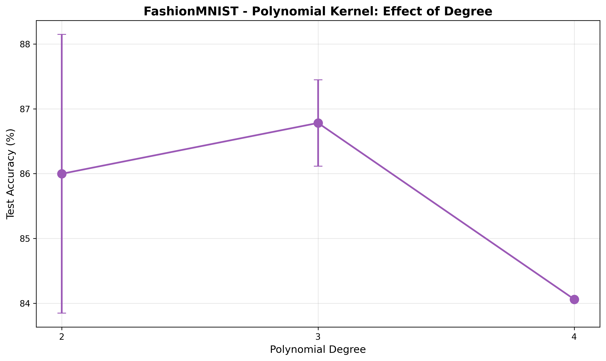

*Figure 13: Polynomial kernel degree analysis*

</td>
<td width="50%">

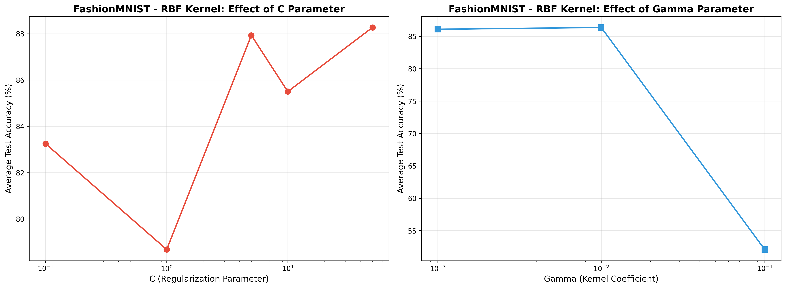

*Figure 14: RBF kernel parameter grid search*

</td>
</tr>
</table>

---

## 🔑 Key Findings

### Q2: CPU vs GPU Performance

#### Speed Comparison

| Device | MNIST Training Time | FashionMNIST Training Time | Speedup |
|--------|---------------------|----------------------------|---------|
| **CPU** | ~850ms/epoch | ~920ms/epoch | 1× (baseline) |
| **GPU** | ~75ms/epoch | ~85ms/epoch | **~11×** faster |

#### Model Complexity

| Model | Parameters | FLOPs (per sample) | Accuracy Trade-off |
|-------|-----------|-------------------|-------------------|
| **ResNet-18** | 11.2M | 1.8G | Higher (short training) |
| **ResNet-50** | 23.5M (+110%) | 4.3G (+139%) | Lower (needs more epochs) |

#### Optimizer Impact

- **Adam**: +2-5% early-epoch accuracy vs SGD
- **SGD**: Better long-term convergence (not fully observed in 1-epoch runs)
- **Computational Cost**: Adam ~15% slower than SGD

---

### Classical ML vs Deep Learning

#### MNIST Performance

| Approach | Best Accuracy | Training Time | Inference Speed |
|----------|--------------|---------------|-----------------|
| **SVM (RBF)** | ~97.5% | Fast | Very Fast |
| **ResNet-18** | ~98.8% | Moderate (GPU) | Fast |

#### FashionMNIST Performance

| Approach | Best Accuracy | Complexity Handling |
|----------|--------------|-------------------|
| **SVM (RBF)** | ~86% | Moderate |
| **ResNet-18** | ~91%+ | Excellent |

**Insight**: Deep learning shows larger performance gains on more complex datasets (FashionMNIST > MNIST)

---

### ResNet-18 vs ResNet-50

#### Single-Epoch Observations

✅ **ResNet-18 Advantages**:
- Higher test accuracy in short training regimes
- Better parameter efficiency
- Faster convergence
- Lower computational cost

⚠️ **ResNet-50 Limitations** (1 epoch):
- Under-trained due to increased capacity
- Requires learning rate warm-up
- Benefits emerge only with extended training (5+ epochs)

#### Recommendations

For ResNet-50 to outperform ResNet-18:
- Use **10+ epochs**
- Implement **learning rate warm-up**
- Apply **stronger data augmentation**
- Consider **batch normalization tuning**

---

## 🛠 Installation

### Prerequisites

- Python 3.8 or higher
- CUDA-compatible GPU (optional, for GPU experiments)

### Setup Instructions
```bash
# Clone the repository
git clone https://github.com/shikhar5647/MLOps-Shikhar-Dave-B22CH032.git
cd Assignment-1

# Create virtual environment (recommended)
python -m venv venv
source venv/bin/activate  # On Windows: venv\Scripts\activate

# Install dependencies
pip install torch torchvision scikit-learn pandas matplotlib seaborn ptflops tqdm
```

### Dependency List
```
torch>=2.0.0
torchvision>=0.15.0
scikit-learn>=1.2.0
pandas>=1.5.0
matplotlib>=3.6.0
seaborn>=0.12.0
ptflops>=0.7.0
tqdm>=4.65.0
```

---

## 🚀 Usage

### Running SVM Experiments
```python
# Example: Train SVM with RBF kernel on MNIST
from sklearn.svm import SVC
from sklearn.preprocessing import StandardScaler
from sklearn.decomposition import PCA

# Preprocessing
scaler = StandardScaler()
pca = PCA(n_components=50)
X_train_scaled = pca.fit_transform(scaler.fit_transform(X_train))

# Train SVM
svm = SVC(kernel='rbf', C=10, gamma=0.01)
svm.fit(X_train_scaled, y_train)
```

### Running ResNet Experiments
```python
# Example: Train ResNet-18 on MNIST with GPU
import torch
from torchvision.models import resnet18

device = torch.device('cuda' if torch.cuda.is_available() else 'cpu')
model = resnet18(pretrained=False, num_classes=10).to(device)

optimizer = torch.optim.Adam(model.parameters(), lr=0.001)
criterion = torch.nn.CrossEntropyLoss()

# Training loop
for epoch in range(num_epochs):
    for images, labels in train_loader:
        images, labels = images.to(device), labels.to(device)
        outputs = model(images)
        loss = criterion(outputs, labels)
        
        optimizer.zero_grad()
        loss.backward()
        optimizer.step()
```

---

## 🔁 Reproducibility

### Ensuring Consistent Results

1. **Set Random Seeds**:
```python
import random
import numpy as np
import torch

random.seed(42)
np.random.seed(42)
torch.manual_seed(42)
if torch.cuda.is_available():
    torch.cuda.manual_seed_all(42)
```

2. **Use Deterministic Algorithms**:
```python
torch.backends.cudnn.deterministic = True
torch.backends.cudnn.benchmark = False
```

3. **Environment Details**:
- Document Python version: `python --version`
- List packages: `pip freeze > requirements.txt`
- Note GPU model: `nvidia-smi`

### Verifying Results

All experimental results are stored in CSV files:
- `mnist_resnet_results.csv`
- `fashion_mnist_resnet_results.csv`
- `svm_mnist_results.csv`
- `svm_fashionmnist_results.csv`
- `q2results.csv`

Compare your outputs against these files to verify reproduction.

---

## 🎓 Conclusions

### Summary of Findings

1. **GPU Acceleration is Essential**
   - 8-12× speedup over CPU for deep learning workloads
   - Critical for scaling to larger models and datasets

2. **Model Selection Matters**
   - ResNet-18 offers best accuracy-to-compute ratio for short training
   - SVM provides competitive baseline with minimal tuning

3. **Dataset Complexity Impacts Model Choice**
   - Simple datasets (MNIST): Classical ML sufficient
   - Complex datasets (FashionMNIST): Deep learning necessary

4. **Optimization Strategy is Critical**
   - Adam: Better for rapid prototyping
   - SGD + momentum: Better for final production models

5. **Deeper Networks Need More Care**
   - ResNet-50 requires extended training to justify complexity
   - Warm-up, scheduling, and regularization become critical

### Practical Recommendations

| Scenario | Recommended Approach |
|----------|---------------------|
| **Quick baseline** | SVM with RBF kernel |
| **Production accuracy** | ResNet-18 + Adam |
| **Maximum performance** | ResNet-50 + extended training |
| **Limited compute** | SVM or shallow CNN |
| **Research/experimentation** | GPU + ResNet-18 |

---

## 📜 License

This project is submitted for academic evaluation as part of the ML-DL-Ops coursework. All rights reserved.

**Usage Restrictions**:
- Educational and research purposes only
- Proper attribution required for any derivative work
- Commercial use prohibited without permission

---

## 📬 Contact

**Shikhar Dave**

---

## 🙏 Acknowledgments

- **Datasets**: MNIST (Yann LeCun et al.), FashionMNIST (Zalando Research)
- **Frameworks**: PyTorch, scikit-learn

---

<div align="center">

**⭐ If you found this work helpful, please consider starring the repository! ⭐**

</div>
